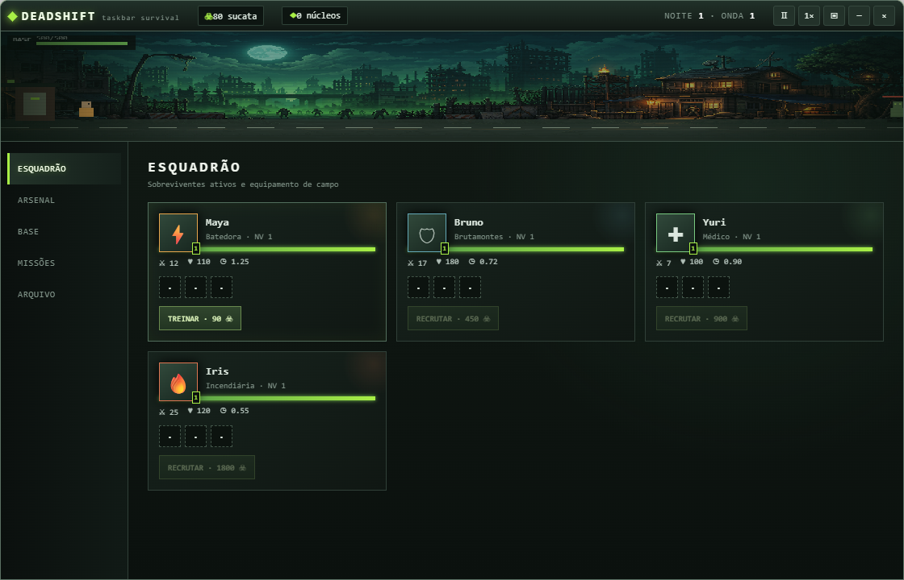

# Deadshift: Taskbar Survival

RPG idle original de sobrevivência zumbi para Windows, projetado para permanecer junto à barra de tarefas enquanto você trabalha.

**[Site oficial e download](https://deadshift-taskbar-survival.vercel.app)**



## Recursos

- Combate automático contra cinco tipos de infectados e chefes
- Quatro sobreviventes com funções e progressão persistente
- Loot com cinco raridades, slots, afixos, qualidade e proteção contra azar
- Melhorias do abrigo, missões, conquistas e progresso offline
- Modo compacto e painel completo
- Salvamento automático local

## Executar

```powershell
npm install
npm start
```

## Gerar executável portátil

```powershell
npm run build
```

O progresso é salvo automaticamente no armazenamento local do aplicativo.
